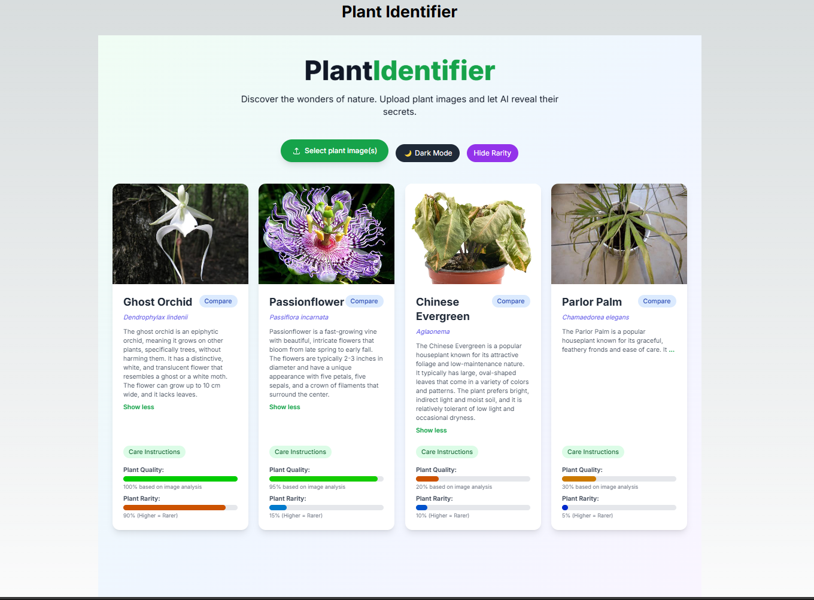

# 🌿 PlantIdentifier - Discover the Wonders of Nature



## 🌟 Overview

**PlantIdentifier** is an application designed to help users identify plants by uploading images. It uses an intuitive approach where users can upload images and receive details about the identified plant species, including its rarity and quality based on visual analysis.

The app features interactive visual elements like quality bars, rarity indicators, and the ability to compare different plant species, all within a modern and user-friendly interface.

App uses google gemini api to extract information

## 🛠️ Features

### 🌱 Image Upload and Plant Identification
- **Easy Image Upload**: Users can upload images of their plants to be processed, allowing the system to automatically identify them.
- **Species Comparison**: After identification, users can compare different plants to better understand their unique characteristics and differences.

### 💡 Visual Feedback
- **Plant Quality**: A bar indicates the plant's quality based on image analysis, with an intuitive visual evaluation system.
- **Plant Rarity**: The app shows how rare the plant is using a rarity bar that ranges from less to more rare, with colors helping users interpret rarity quickly and easily.

### 🎨 Customizable Interface
- **Dark Mode**: Easily switch between light and dark mode, allowing users to choose the display mode that best suits their visual preferences.
- **Interactive Details**: Users can expand and collapse additional information about plant care, such as watering, light, temperature, and soil requirements.

### 🔍 Precise Information Display
- **Care Instructions**: Provides detailed instructions for caring for each identified plant, including watering guides, light exposure, ideal temperatures, and recommended soil types.

## 📁 Project Structure

The project follows a modular and scalable architecture, making it easy to maintain and grow over time.

```plaintext
├── app/
│   ├── fonts/                       # Custom fonts used in the project
│   ├── favicon.ico                  # App icon
│   ├── globals.css                  # Global styles and Tailwind configuration
│   ├── layout.tsx                   # Base structure of the app
│   ├── page.tsx                     # Main page where users interact
│   └── components/                  # Reusable components of the application
│       └── PlantIdentifier.tsx      # Main logic for image upload and analysis
├── node_modules/                    # Project dependencies 
├── public/
│   └── countries-110m.json          # Public files for displaying images or other data
├── .env.local                       # Environment variables
├── .eslintrc.json                   # ESLint configuration for code linting
├── .gitignore                       # List of files and folders to be excluded from the repository
├── next-env.d.ts                    # Next.js types
├── next.config.mjs                  # Custom Next.js configuration
├── package.json                     # Project dependencies and scripts
├── package-lock.json                # Dependency lock file
├── postcss.config.mjs               # PostCSS configuration
├── README.md                        # Project documentation
├── tailwind.config.ts               # Tailwind CSS configuration
├── tsconfig.json                    # TypeScript configuration
